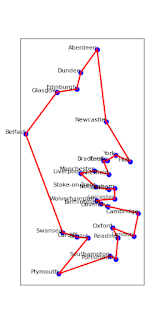

## The Travelling Salesman

In 2024, during my year of intensive study to broaden my tech skills, I completed Coursera's excellent series of [Python courses](https://www.coursera.org/specializations/python#courses) (in one week!) For further Python practice, I followed that with a series of projects, and this was my favourite one. It is a genetic algorithm that tackles the classic Travelling Salesman problem.

In case you're not familiar with the problem, the challenge is to find the shortest possible route through a series of places, visiting all of them and returning to the starting point. It sounds simple but the number of possible routes rises rapidly the more places there are. I used 30 UK cities as my data points.

The number of possible routes can be expressed as (x-1) factorial. The -1 is because the starting point doesn't matter. You can see this if you consider a route with only 3 places to visit. There are only 2 possible routes in this scenario, clockwise and anti-clockwise. Plugging 2 into the above formula gives us (3-1) factorial = 2x1 = 2 possible routes.

Look at how fast the numbers increase:

5 places = 24 routes.

10 places = 362,880 routes.

20 places = 1.216451004 x 10^17 routes.

30 places = 8.841761993 x 10^30 routes.

For perspective, the age of the known universe in seconds is thought to be 4.35 x 10^17. The number of possible routes for the travelling salesman between my 30 UK cities is over two trillion times that number.

Finding the shortest route clearly can't be done by crunching through all the possible routes, then. This is where a genetic algorithm comes in as a way to tackle the challenge. It can't promise the optimum solution but it can produce an approximation of it very quickly.

The above image is the best solution I found over a lot of testing. It arrived at it approximately 30% of the time I ran the script.

Here are three starting random routes:

Here are three not-quite optimal solutions:

And the optimal one again (optimal because it's the shortest total distance):

## Implementation

I created a class called Destination, where each Destination object has an x and y coordinate and a name. At the start of the main code it loads the UK cities data and creates a look-up table of the distances between every destination and every other destination. This is just an absolute distance, not taking into account roads, the sea, traffic and other real world information. It would be interesting to look up the actual travel distances between every pair of cities but that's 900 combinations and the point of this isn't to create actual usable logistical travel information.

Then there's a Route class which contains a list of Destination objects. Each Destination is in the list once and once only. The effectiveness of the route can be calculated by summing the distances between each step in the route, plus the extra step of returning back to the starting point at the end.

A population of 1000 Route objects are created, each with the 30 destinations in random order. The 'fitness score' of each is calculated, which in this case is the total distance of the route. This is Generation 0.

For the next generation, a subset of the best scoring (i.e. shortest distance) routes are used to create a new population, and the rest are discarded. A crossover function combines two of the best scoring routes to form a 'child' route. This is done in a way that ensures each destination appears in the new route once and once only.

There is also a chance of mutation. If this triggers, the child route is modified in one of two ways:

Method 1: Pick a destination and switch it with one of its neighbouring destinations.

Method 2: Pick a destination and move it to a random other position in the route.

Sometimes it does this more than once, in an attempt to break out of local minimums. By local minimums, I mean it has climbed a hill but missed the bigger hill.

The new population is filled to the same size as the previous one using the above steps, and then replaces it. Then the whole process is repeated for multiple generations.

The code is here in the Github repo if you want to see.

## Optimal Variables

Here are the variables I used in a config file and what I found to be their optimal values:

**POPULATION_SIZE** = 1000. Reducing this led to a worse result. Surprisingly, though, increasing it didn't improve it. When I tried a population of 10,000 it was actually worse.

**PERCENTAGE_OF_POPULATION_THAT_CAN_REPRODUCE** = 0.2. This is a value between 0 and 1. About 0.2 worked the best (i.e. 20%). This meant that for every generation, the 200 shortest routes from a population of 1000 are used to create the subsequent generation. A larger subset meant that successful mutations are often lost. On the flipside, reducing this right down so that, say, the best two in every generation are always picked, meant that it rapidly finds a local minimum but it usually isn't as good over many generations.

**MUTATION_RATE** = 0.6. This is about optimum in this problem space with the above values. It means 60% of the routes in each generation are mutated. That sounds a lot but we're only picking from the top 20%, so 60% is actually pretty conservative - higher ought to arrive at a solution faster. With a 100% mutation rate it still generally arrived at a good solution, although sometimes lost it again in the next generation.

**BIAS_TOWARDS_SWITCHING_NEIGHBOURS** = 0.2. This allows me to change between the two mutation types. Method 2 (moving a random destination to somewhere else in the route) worked better than Method 1 (switching two neighbouring destinations), hence this value is low.

**GENERATIONS** = 200. It almost always settled on a solution within 100 generations, and usually within 50. After that it almost never changed. I played with the settings a lot to try to coax it out of local minimums but without much success. Running the program multiple times was much more effective for finding an optimum solution than running it for lots more generations. This strategy of starting again and comparing different results could of course be done in the code. A version that, say, ran for an hour, restarting every 100 generations, would be pretty much guaranteed to find the optimum in this particular data set.
